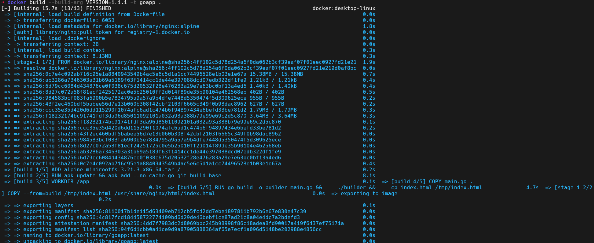
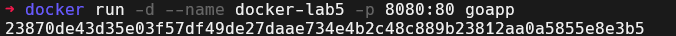
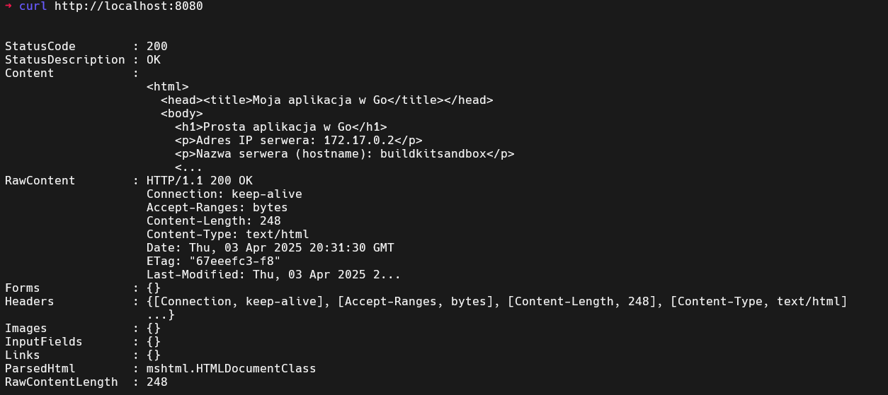
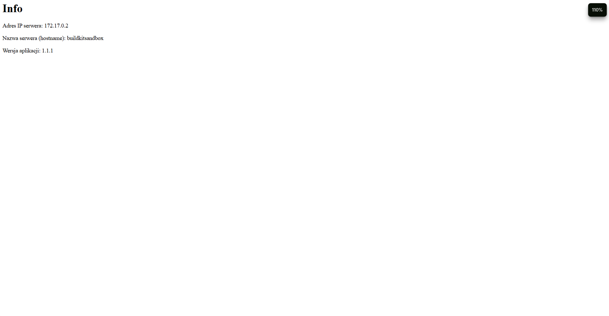

# Sprawozdanie z laboratorium 5 - Docker Multi-stage Build

## Plik Dockerfile

```dockerfile
FROM scratch AS build

ADD alpine-minirootfs-3.21.3-x86_64.tar /

ARG VERSION="1.0"

SHELL ["/bin/sh", "-c"]

RUN apk update && apk add --no-cache go git build-base

WORKDIR /app

COPY main.go .

ENV VERSION=$VERSION

RUN go build -o builder main.go && \
    ./builder && \
    cp index.html /tmp/index.html

FROM nginx:alpine

COPY --from=build /tmp/index.html /usr/share/nginx/html/index.html

HEALTHCHECK --interval=30s --timeout=3s --retries=3 \
  CMD wget -q -O- http://localhost:80 || exit 1

CMD ["nginx", "-g", "daemon off;"]
```

## Polecenie do budowy obrazu

```bash
docker build --build-arg VERSION=1.1.1 -t goapp .
```

Wynik działania polecenia:



## Potwierdzenie działania kontenera

Użyte polecenie:

```bash
docker run -d --name docker_lab5 -p 8080:80 goapp
```



## Potwierdzenie poprawności działania aplikacji

Użyte polecenie curl do weryfikacji:

```bash
curl http://localhost:8080
```

Wynik działania curl:



Zrzut ekranu z przeglądarki:



Autor sprawozdania: Jan Ożga
